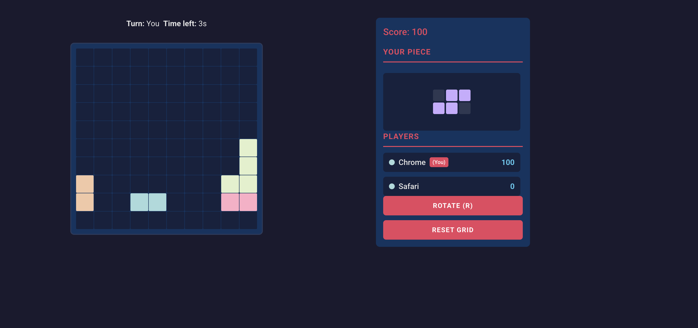

# Boxfit

A fast, turn‑based, two‑player block‑placement game built with React, Vite, Socket.IO, and an Express backend. Players join a shared room, take alternating turns to place Tetris‑like pieces on a 10×10 grid, clear full rows for points, and race for the highest score.

## Screenshots

> Place these images in `frontend/public/screenshots/` and the links below will render on GitHub.

- Join Screen
  
  

- In‑Game (empty grid)
  
  

- In‑Game (with pieces and score)
  
  

## Features

- Two‑player, turn‑based gameplay with a visible turn timer
- Real‑time synchronization via Socket.IO
- 10×10 grid with classic tetromino‑style pieces
- Row clearing: complete rows are cleared and award points
- Scoreboard and current player indicator
- Rotate piece action and grid reset

## Tech Stack

- Frontend: `React 19`, `Vite`, `TypeScript`, `CSS Modules`
- Realtime: `socket.io-client`
- Backend: `Node.js`, `Express`, `Socket.IO`

## Project Structure

```
boxfit/
├── backend/
│   ├── package.json
│   └── server.js             # Express + Socket.IO server (defaults to port 3000)
├── frontend/
│   ├── index.html
│   ├── package.json
│   ├── public/
│   │   └── screenshots/      # Put README images here (join.png, ingame-empty.png, ingame-playing.png)
│   └── src/
│       ├── components/
│       ├── styles/
│       └── main.tsx
└── README.md
```

## Getting Started

Run the backend and frontend in separate terminals.

1) Backend

```
cd backend
npm install
npm run dev
```

The server starts at `http://localhost:3000`.

2) Frontend

```
cd frontend
npm install
npm run dev
```

Vite runs on `http://localhost:5173` by default. The backend CORS is already configured for `5173` and `5174`.

## How to Play

1. Open the frontend in your browser.
2. On the Join screen, enter:
   - Name: the display name shown to other players
   - Room ID: any string; share the same ID with a friend to play together
3. When two players are in the room, the game starts. The UI shows:
   - Current turn owner and a countdown timer
   - 10×10 grid on the left
   - Scoreboard and your current piece on the right
4. Only the active player can place a piece. Use Rotate (or press `R`, if enabled in the UI) to rotate before placing.
5. Completing a full row clears that row and awards 100 points per row.
6. After you place, the turn automatically passes to the other player. If the timer expires, the turn is skipped.
7. Use Reset Grid to clear the board and scores for a fresh start.

## Configuration

- Server Port: backend listens on `3000` (see `backend/server.js`).
- Allowed Origins: `http://localhost:5173` and `http://localhost:5174` are permitted in CORS and Socket.IO.

## Available Scripts

Backend (`backend/package.json`):

- `npm run dev` – start the Express + Socket.IO server with nodemon.

Frontend (`frontend/package.json`):

- `npm run dev` – start Vite development server
- `npm run build` – type‑check and bundle for production
- `npm run preview` – preview the production build locally

## Notes on Gameplay Logic

- Grid size is `10 × 10`.
- Classic shapes include `I, O, T, L, J, S, Z`.
- On each valid placement, the server checks for any complete rows and clears them (no gravity/collapse), adding `100` points per row to the placing player.
- The game proceeds strictly with two players. If a player leaves, the room returns to `waiting` until a second player joins again.

## Production Considerations

- Add persistence (DB) for long‑lived rooms and scores.
- Add authentication to prevent name collisions.
- Deploy backend (e.g., Render, Railway) and frontend (e.g., Netlify, Vercel). Update CORS and Socket.IO origins accordingly.

